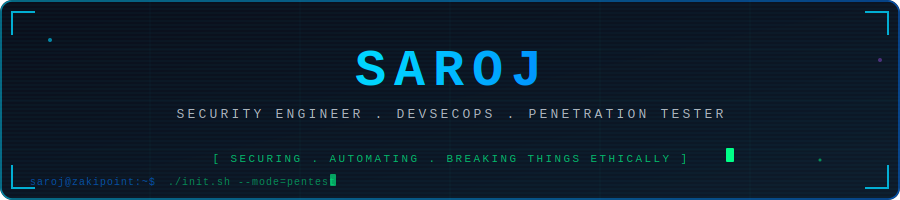
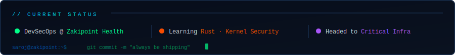

<div align="center">



</div>

---



> 5 years breaking things professionally so others can't break them maliciously.
> Hardening healthcare infrastructure at Zakipoint Health where a security gap isn't just a business problem, it's a patient safety problem.
> Certified ethical hacker and cloud architect by training. DevSecOps engineer and penetration tester by practice.
> Headed toward **kernel & OS level security** and **critical infrastructure** where the stakes are highest and the attack surface goes all the way down to the metal.

---

```bash
$ cat /etc/saroj/profile.conf
```

```ini
[identity]
name        = Saroj
role        = Security Engineer · Penetration Tester · DevSecOps
experience  = 5+ years
employer    = Zakipoint Health
portfolio   = saroj345.github.io

[certifications]
ethical_hacking = CEH  — Certified Ethical Hacker
cloud_arch      = AWS Solutions Architect Associate
cloud_found     = AWS Cloud Practitioner

[specializations]
offensive    = Penetration Testing · Exploit Development · OWASP Top 10
defensive    = Cloud Hardening · Threat Hunting · DevSecOps Pipelines
domain       = Healthcare Infrastructure · HIPAA-compliant Systems
exploring    = AI Security · ML Threat Modeling · Rust

[currently]
role         = DevSecOps @ Zakipoint Health
context      = Healthcare infra · where uptime and security are non-negotiable
growing_into = Kernel & OS Security · Critical Infrastructure · Binary Exploitation

[philosophy]
mindset      = "If I can automate it, I will. If I can break it, I must."
approach     = "Understand how things fail before claiming they are secure"
reliability  = "In mission-critical systems, 99% is not enough"
motto        = "Break it. Fix it. Automate it. Ship it."
```

---



---



---



---

## `$ git log --oneline --graph`

<div align="center">

[](https://github.com/saroj345)

</div>

---

## `$ curl -s saroj345.github.io/connect`

```bash
→ Role      : DevSecOps Engineer · Penetration Tester
→ Open to   : Security tooling · Kernel/OS research · Critical infra OSS projects
→ Portfolio : https://saroj345.github.io
→ Heading   : Kernel & OS Security · Critical Infrastructure · Binary Systems
→ Motto     : "Break it. Fix it. Automate it. Ship it."
```

<div align="center">

[](https://saroj345.github.io)
[](https://github.com/saroj345)

---

*"The more I learn about security, the more I realize how little the surface tells you."*


</div>

